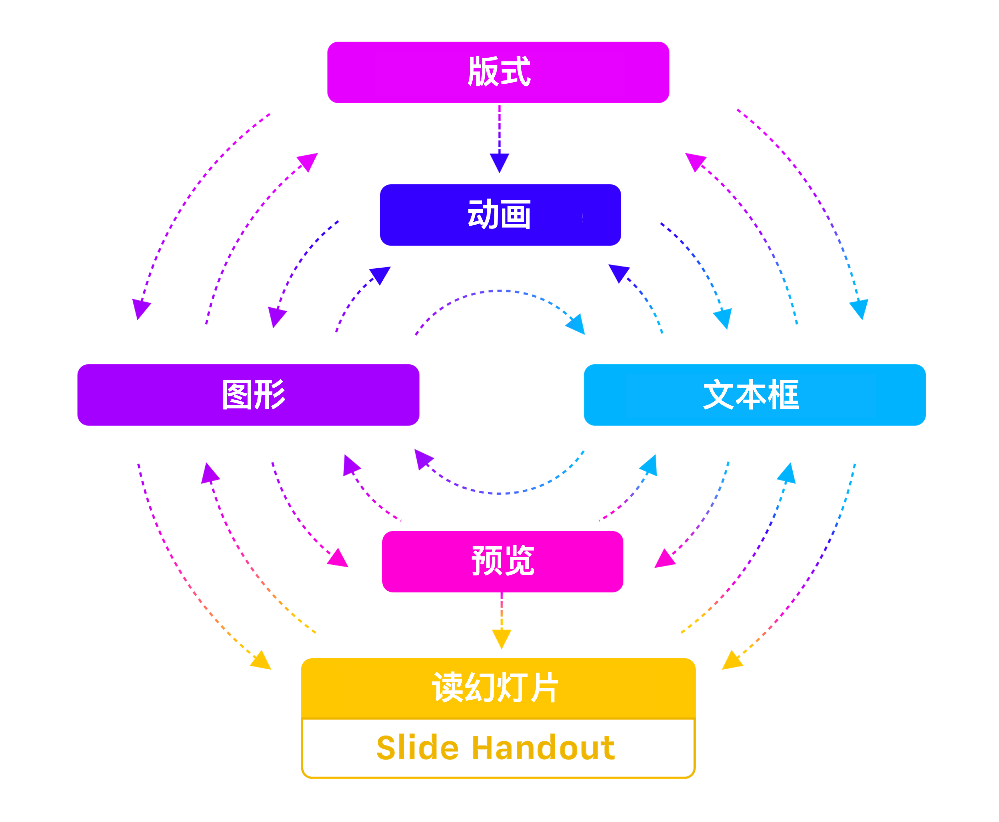
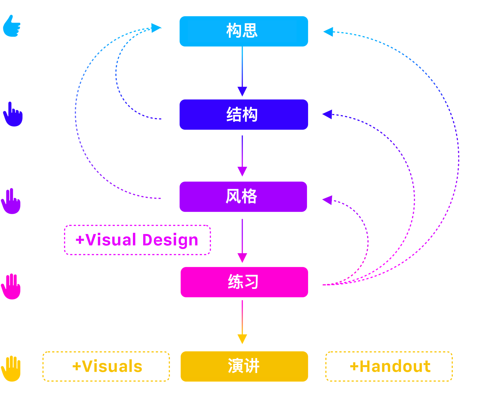

# 以故事为中心：打造有说服力的演示
你有没有发现，市面上的PPT课程总在教些华丽的外表：酷炫动画、精美配色、复杂图表，却很少关注内容本质？

而现实中，决策者只关心一点：”别绕弯子，直接讲重点。”这说明了什么？PPT的核心不是设计，而是故事。

正如那句流传的玩笑：”做PPT的不如讲PPT的，讲PPT的不如听汇报的。”

今天，我想带大家跳出设计思维，学习如何构建真正有说服力的内容，解决我们在PPT制作中遇到的各种困扰。

## 第一部分：演示的本质
一场精彩的演示，本质上就是一个精彩的故事。演示到底是什么？简单来说，演示是讲述、视觉辅助和讲义的结合。三者缺一不可，但重要性有主次之分。

花哨的图片、满屏密密麻麻的要点、复杂的图表、甚至”万能爆款”文案，仅仅能抓人眼球，而简洁清晰的呈现和能够引起共鸣的故事，才能真正打动人心。

要打动观众，我们需要一个引人入胜的故事和清晰顺畅的表达。

## 第二部分：常见的误区
在PPT制作过程中，我们经常会遇到三个典型问题，这些都源于我们舍本逐末，过分关注工具和形式而忽略了故事本身。

**时间问题**：我们经常花大量时间调整设计细节，却发现临近截止日期时内容还没完善。这往往是因为没有清晰的计划和优先级，导致效率低下。

**焦点偏移**：当我们沉迷于寻找完美图片或制作精美动画时，内容的逻辑和深度往往被忽视。结果是一份看起来漂亮但缺乏说服力的演示。

**信心不足**：许多人在演示时感到紧张，这通常不是因为PPT做得不够精美，而是因为对内容不够熟悉或没有充分练习。

这些问题的根源，是我们在制作PPT时没有明确的方向和步骤，导致迷失在细节中。

我们需要回归本质，找到一套系统化的方法来解决这些问题。

## 第三部分：修辞学的智慧
接下来，我将为大家介绍一个经典而实用的框架：**修辞五准则**。 它能帮助我们系统地解决前面提到的所有问题。这个框架既有深厚的理论基础，又有广泛的实践验证。

修辞五准则是逻辑学中关于如何有效沟通和打动人心的经典框架。这套框架其实很简单，包括以下五个步骤：
1. **构思**：确定我们要讲什么，准备好素材和论据。
2. **结构**：把我们的内容组织得有条理，让听众容易跟上我们的思路。
3. **风格**：选择适合场合和听众的语言和表达方式。
4. **记忆**：把内容熟记于心，这样讲起来才能流畅和自信。
5. **表达**：讲出我们的故事的同时，也要注意我们的语调、眼神接触和肢体语言等。

这五个步骤不是简单的线性过程，而是相互影响、彼此完善的循环系统。后面的步骤常常会帮我们发现前面需要调整的地方，通过这种不断反馈和优化，我们的演示才能越来越出色。

## 第四部分：以故事为中心的 PPT 制作
### 1. 确立主题
演示的核心其实是观众，而不是我们自己。观众关心的是他们面临的挑战和可能的解决方案，我们需要把注意力放在满足他们的需求上。所以，从一开始就要站在观众的角度思考问题。

因此，我们的创作过程应该从两个问题开始：
- 谁是我们的观众？
- 我们故事的目的是什么？

明确了这两个问题，我们才能有的放矢的进行第二步。

### 2. 编写故事
一场精彩的演示，源自一个精彩的故事。 不要只想着观众会看到什么，先想好我们要讲什么，因为内容比形式更重要。

这里有两种常见的编写故事的方式，我们可以根据自己的习惯选择：
- 第一种是把材料直接贴在幻灯片备注里，我们可能已经有非常多的文本材料，在考虑具体展示方式之前，先把原始内容充实完整。
- 另一种是在备注里写大纲：先列出演示要点，不用管幻灯片的样子，专注于我们要讲的内容。

把故事写在PPT备注里，确保它有清晰的开头、中间和结尾，说明问题、挑战和解决方案。这样观众就能轻松跟上我们的思路。

### 3. 组织结构
PPT上只放简洁的标题、少量要点和有意义的图表，不要密密麻麻的文字。而完整的故事、例子和解释则全部写在备注里。用演讲者视图播放时，我们能同时看到幻灯片和备注。

这样就能专注于讲好故事，而不是被复杂设计分散注意力。

图片和表格只是辅助工具，它们应该帮助观众理解我们的讲述，而不是喧宾夺主。

这种内容与展示的分离，让我们真正做到以故事为中心。

### 4. 刻意练习
有效的练习能带给我们两个重要收获：

首先，我们不是简单地重复，而是通过练习来感受自己的观点，听自己的声音，找出不顺的地方并改进。从而让故事深入内心。专业上，这叫”刻意练习”。

其次，练习能减少我们的紧张。对脚本越熟悉，讲的时候就越有底气，因为我们知道自己是准备充分的。

### 5. 从故事到精彩演示
最后开始你的精彩演示吧！

## 总结
我们已经学习了以故事为中心的五步法，让我们简单回顾一下：

要做一场精彩的PPT演示，关键是抓住故事的本质。从我们想说的内容开始，而不是从设计版式开始，因为故事是核心，设计是辅助。这正是我们这套方法的精髓所在。
1. **构思**：确立主题，明确观众和目的
2. **结构**：编写故事，构思完整内容
3. **风格**：通过组织文本与视觉元素，简洁呈现内容，添加恰当的图表，详情写在备注
4. **练习**：刻意练习，让内容深入内心，建立自信
5. **演示**：带着充分准备和自信，打动你的观众

记住，故事是核心，设计只是辅助工具。精心准备的内容和自信的表达，才是真正打动观众的关键。
现在，去创造你的故事吧！无论是工作汇报还是项目提案，这套方法都能帮你更有力地传达信息。
—

参考：[ia.net：how can we make presentations better_](https://ia.net/topics/how-can-we-make-presentations-better)
