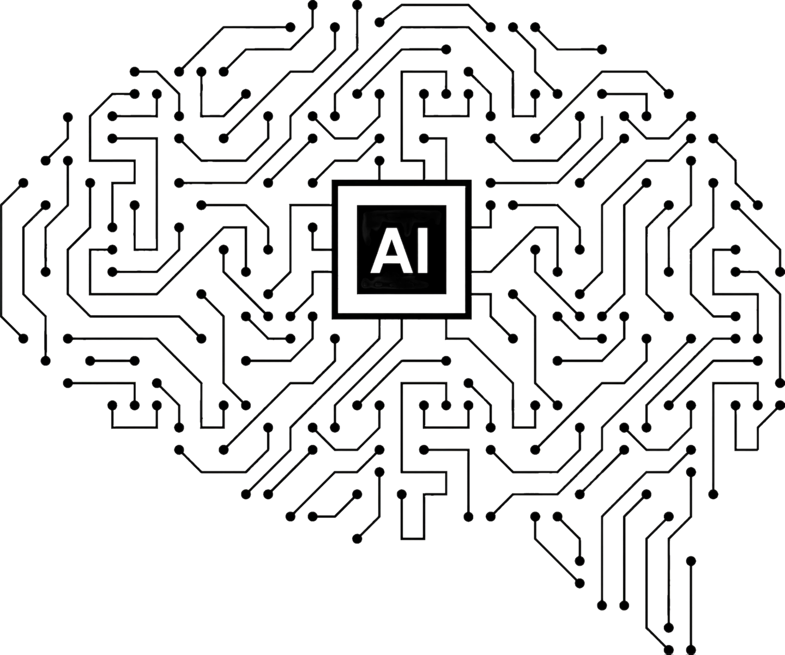

---

## 引言

现在AI技术发展的这么快，我们身边总有两种极端的声音。

一边是"夸夸党"，他们觉得AI简直无所不能，给你看几个聊天记录和画图案例就断言AI已经超越人类了。

另一方面是"恐慌党"，天天散播焦虑，说AI很快就会抢走我们的饭碗，列举各种AI写小说、写代码、做PPT，做视频的例子，搞得大家人心惶惶。

今天，咱们就来好好聊聊AI到底是什么，它有哪些局限，为什么尽管它很强大，但还是取代不了会思考的人，以及我们怎么在AI时代保持自己的不可替代性。

## 一、知其然：AI能做什么

首先，我们得实事求是地看看当前的AI技术，特别是大语言模型到底能干些啥。

**内容创作**：AI确实挺厉害的，能写文章、生成代码、做创意写作；

**语言处理**：它能翻译、做摘要、回答问题；

**数据分析**：它能整理数据、分析趋势、生成报告；

**辅助设计**：它能生成图像、给UI提建议、激发创意；

**学习辅助**：它能提供个性化教学、解答知识问题；

**决策支持**：它能分析选项、评估风险、提供建议。

这些能力确实给了我们AI很强的印象，但要真正理解AI的局限，我们得先弄明白它是怎么工作的。

## 二、知其所以然：AI如何工作

市面上有很多介绍大语言模型的材料，视频也好，文章也好，甚至是论文，大部分都充斥着诸如Transformer架构、自注意力机制等各种高深术语，让人云里雾里，但我们普通人没必要深究这些技术细节。抛开这些复杂术语，底层逻辑其实很简单，就是在做"概率预测"。

它通过几种关键机制运作：

1. **概率推理**：AI不是真正思考，而是基于统计概率预测。它分析大量文本后，计算出在特定语境下各个词出现的可能性。

2. **模式识别**：AI通过分析海量数据，识别出语言中的统计规律和模式，学习了各种表达方式和知识关联。

3. **序列预测**：它的核心任务就是计算并生成最可能的下一个词。

4. **模仿学习**：它模拟语言模式而非理解内容。

当我们问AI一个问题时，它不是理解问题的含义，而是根据训练数据中的模式来预测最可能的回答。

这也解释了为什么最先进的AI在回答"9.11和9.9哪个大"这种简单问题时也可能出错——它缺乏真正的理解能力。

简单说，AI是个出色的模仿者，但不是真正的思考者。

## 三、了解AI的能力边界

《礼记·中庸》里说："博学之，审问之，慎思之，明辨之，笃行之"。

这个经典的认知框架，恰好能帮我们看清AI的能力边界。

在"**博学**"方面，AI确实很强。它通过海量数据训练，积累了惊人的知识量。

在"**审问**"方面，AI也能做到一部分。它能提出相关问题，但缺乏真正的好奇心。

到了"**慎思**"这一步，AI就明显不行了。它缺乏真正的因果推理能力，无法进行深层次的逻辑分析。

"**明辨**"能力上，AI更是差远了。它常常生成看似合理但实际错误的内容，业内称为"幻觉"。

至于"**笃行**"，AI则完全做不到。它无法通过实践检验知识，也无法像我们通过行动获得经验智慧。

这五个维度的分析，清楚地展示了AI与人类思维的本质区别。

## 四、AI的局限性

AI无法替代人类的原因可以归纳为五点：

1. **无法理解语境**：AI理解不了深层文化背景和社会语境，它不懂为什么笑话好笑，悲剧为何感人。

2. **无法原创思考**：AI只会重组和模仿已有内容，创不出真正原创的想法。

3. **缺乏内驱力**：AI没有内在动机和目标，而人类创造常常来自解决问题的渴望或表达情感的需要。

4. **应对未知差**：AI遇到训练数据没覆盖的新情况就懵了，缺乏人类的灵活应变能力。

5. **不能自我反思**：AI不会自我反思，不能独立评估自己的输出并改进，它需要人类不断提供反馈才能进步。

## 五、掌握工具，而不是被工具掌握

要在AI时代保持不可替代性，关键是掌握工具，而不是被工具掌握。

首先，了解AI的逻辑和工作原理，这样你才知道怎么用它，以及为什么它会给出某种结果。

其次，不断深化你的专业知识，只有拥有深厚的领域知识，你才能跟AI有效互动，并判断它输出的质量。

第三，保持批判性思维，不要盲目接受AI的结果，要仔细审视和验证。

最重要的是，把AI当作激发思维的工具，而不是替代思考的工具。

在AI普及的时代，真正的思考能力反而更加珍贵了。

## 六、AI无法替代的能力

在AI时代，有五种核心能力将让你保持不可替代：

1. **创造性思维**：能够突破常规，提出真正原创的想法和解决方案。

2. **情感智能**：理解和管理情绪，建立有效的人际关系，这是AI永远学不会的。

3. **批判性思考**：能评估信息的准确性和意义，辨别AI生成内容中的错误。

4. **跨领域整合**：将不同领域的知识结合起来创造新价值。

5. **适应性学习**：能快速适应变化，持续学习新技能。

培养这些能力，你就能在AI时代保持竞争力。

## 七、在职场中与AI共存

### 7.1 将AI视为增强工具而非替代品

在职场中，与其视AI为威胁，不如将其视为增强自身能力的工具。

你可以使用AI处理重复性任务，释放时间专注于需要创造力的工作。

你也可以利用AI快速生成初稿或创意雏形，然后进行人工优化和深化。

通过与AI的互动，你能获取多元视角和灵感，但关键是保持最终决策权。

这种协作关系能让你在职场中发挥最大价值，同时减轻工作负担。

### 7.2 职场中的AI使用策略

使用AI时，记住这四点关键策略：

第一，**明确分工**。让AI做它擅长的数据分析、初稿生成，你专注于战略决策和人际沟通。

第二，**建立审核习惯**。别完全相信AI的输出，特别是涉及事实和专业知识时，一定要自己验证。

第三，**持续学习**。AI技术在飞速发展，我们需要不断更新对它能力和局限的认识，随时调整使用方法。

第四，**发展自己的独特优势**。重点培养AI难以复制的能力，比如创造力、领导力和情感连接。

这样的策略组合，能帮你在AI时代保持领先地位。

## 结论

AI确实很强大，但它永远替代不了会思考的人。

创新的火花、情感的深度和思想的原创性，这些都是人类独有的特质。AI可以帮我们更高效地工作，但它不能替代我们的思考。

在这个不用思考就能从AI获得答案的时代，保持独立思考能力反而变得更加重要。

通过了解AI的本质，掌握与它协作的方法，同时培养自己的独特优势，我们每个人都能在AI时代保持不可替代性。

记住，思考力是你在这个时代最宝贵的资产。

---

本文同步发布于Medium：[Worried About Being Replaced by AI? Thinking Makes You Irreplaceable](https://alvin7m2.medium.com/worried-about-being-replaced-by-ai-thinking-makes-you-irreplaceable-d08fe69fc203)

## Introduction

With AI technology advancing at breakneck speed, we're constantly bombarded with two extreme perspectives.

On one side are the AI cheerleaders who act like it's practically omnipotent. They'll flash a few cherry-picked chat examples and AI-generated images, then boldly claim that machines have already left humans in the dust.

On the flip side, we have the doomsayers spreading anxiety like wildfire, insisting that AI is coming for your job tomorrow. They'll rattle off examples of AI writing novels, coding software, designing presentations, and creating videos – leaving everyone in a state of professional panic.

Today, let's cut through the noise and have a heart-to-heart talk about what AI really is, where its genuine limitations lie, why it still can't replace humans with critical thinking skills, and how we can stay irreplaceable in this rapidly evolving landscape.

## I. Knowing What: What AI Can Do

First, let's take a hard look at what current AI technology – particularly large language models (LLMs) – can actually accomplish.

In content creation, AI has become remarkably capable, churning out articles, generating functional code, and crafting creative pieces. For language processing, it excels at translation, summarization, and answering a wide range of questions. When it comes to data analysis, AI can organize information, spot trends, and compile comprehensive reports.

In the design realm, it can generate images, offer UI recommendations, and spark creative ideas. For learning support, it provides personalized instruction and answers knowledge-based questions. And in decision support, it analyzes options, evaluates risks, and offers recommendations.

No doubt about it – these capabilities are impressive, but to truly grasp AI's limitations, we need to peek under the hood and understand how it actually works.

## II. Knowing Why: How AI Works

The market is flooded with explanations of large language models – videos, articles, academic papers – most filled with complex terms like "Transformer architecture" and "self-attention mechanism." This leaves most people's heads spinning. But here's the thing: as everyday users, we don't need to get bogged down in these technical details. Strip away the complexity, and it all boils down to "probability prediction."

AI operates through several key mechanisms:

First is **probabilistic reasoning**. AI doesn't actually think – it predicts based on statistics. After digesting massive amounts of text, it calculates which words are most likely to appear in specific contexts.

Second is **pattern recognition**. By analyzing enormous datasets, AI identifies statistical patterns in language, learning how different expressions and knowledge points typically connect.

Third is **sequence prediction**. At its core, AI is constantly calculating which word is statistically most likely to come next in any given sequence.

Fourth is **imitation learning**. AI simulates language patterns rather than truly understanding content.

When you ask AI a question, it's not comprehending your query's meaning. Instead, it's predicting what text patterns would most likely follow your question based on its training data.

This explains why even cutting-edge AI can stumble on elementary questions like "which is greater, 9.11 or 9.9" – it's clueless about actual meaning.

In essence, AI is like a world-class mimic rather than a true thinker.

## III. Understanding AI's Capability Boundaries

The ancient Chinese classic "Book of Rites" (《礼记·中庸》) outlines a five-step process of knowledge acquisition: "博学之，审问之，慎思之，明辨之，笃行之" – which translates to "extensive learning, careful questioning, careful thinking, clear discernment, and earnest practice."

This timeless cognitive framework gives us a perfect lens to see through AI's capability boundaries.

When it comes to "博学" (extensive learning), AI truly shines. Through massive data training, it has soaked up tons of information. For "审问" (careful questioning), AI shows partial competence. It can generate relevant questions but doesn't have an actual curious bone in its body or the ability to probe deeply.

At the stage of "慎思" (careful thinking), AI falls dramatically short. It lacks authentic causal reasoning and cannot perform the kind of deep logical analysis that humans take for granted. Regarding "明辨" (clear discernment), AI is woefully inadequate. It regularly produces content that seems plausible but contains factual errors – what experts call "hallucinations."

As for "笃行" (earnest practice), AI completely fails. It cannot test knowledge through real-world application or gain wisdom through lived experience as humans naturally do.

This five-dimensional framework vividly illustrates the fundamental gap between AI and genuine human cognition.

## IV. AI's Limitations

Why can't AI replace humans? The answer boils down to five fundamental limitations:

First, AI lacks deep contextual understanding. It can't grasp cultural nuances or social cues – it doesn't truly understand why jokes make us laugh or why tragedies move us to tears.

Second, AI cannot generate truly original thought. It can only recombine and imitate existing content, never creating genuinely novel ideas from scratch.

Third, AI has no intrinsic motivation or purpose. Human creativity often springs from our desire to solve problems or express emotions – drives that AI simply doesn't possess.

Fourth, AI hits a wall when confronted with scenarios outside its training data. It lacks the human ability to think on its feet when facing novel situations.

Finally, AI cannot engage in meaningful self-reflection. It can't independently evaluate its output or improve without human guidance and feedback.

## V. Master the Tool, Don't Be Mastered by It

To remain irreplaceable in the AI era, you need to be the one calling the shots, not the other way around.

First, develop a solid understanding of AI's underlying logic and limitations. This knowledge helps you use it effectively and understand why it produces specific outputs.

Second, double down on your professional expertise. Dig deeper into your domain knowledge to effectively collaborate with AI and critically evaluate the quality of its contributions.

Third, sharpen your critical thinking skills. Never take AI-generated content at face value – always scrutinize and verify its outputs.

Most importantly, use AI as a springboard for your own thinking, not as a replacement for it. Let it handle routine tasks while you focus on higher-level cognition.

In an age where AI is becoming ubiquitous, genuine human thought is more valuable than ever.

## VI. Abilities AI Cannot Replace

In the AI era, five core human capabilities will make you bulletproof:

**Creative thinking**: The ability to think outside the box and generate truly original ideas and solutions.

**Emotional intelligence**: Understanding and navigating human emotions, building meaningful relationships, and demonstrating empathy – areas where AI remains completely clueless.

**Critical thinking**: The capacity to evaluate information critically, distinguish fact from fiction, and spot the "hallucinations" that plague AI-generated content.

**Cross-domain integration**: The skill of connecting the dots between different fields to create novel insights and value that specialized AI systems cannot match.

**Adaptive learning**: The human superpower of quickly pivoting to new circumstances and continuously evolving your skillset.

By cultivating these distinctly human abilities, you'll maintain your edge in an increasingly AI-driven world.

## VII. Coexisting with AI in the Workplace

### 7.1 Viewing AI as an Enhancement Tool Rather Than a Replacement

In the workplace, instead of seeing AI as a threat, reframe it as a powerful tool that can supercharge your workflow.

Leverage AI to tackle mundane, repetitive tasks, freeing your time and mental energy for creative endeavors that truly move the needle. Use AI to quickly generate first drafts or initial concepts, which you can then refine and elevate with your human touch and expertise. Engage with AI to spark fresh perspectives and ideas, while always keeping your hands on the wheel as the final decision-maker.

This collaborative approach allows you to maximize your impact in the workplace while reducing the drudgery of routine tasks.

### 7.2 AI Usage Strategies in the Workplace

When incorporating AI into your workflow, keep this game plan in mind:

First, establish a clear division of labor. Let AI handle what it does best – crunching data, generating drafts, and automating routine tasks – while you focus on strategic thinking, creative problem-solving, and building human connections.

Second, develop rigorous review habits. Never take AI-generated content at face value, especially when it involves factual claims or specialized knowledge. Always verify independently.

Third, commit to continuous learning. AI capabilities are evolving at warp speed, so regularly update your understanding of what these tools can and cannot do, and adjust your approach accordingly.

Fourth, double down on your uniquely human strengths. Invest in developing skills that AI struggles to replicate – creative thinking, emotional intelligence, leadership, and strategic vision.

This strategic approach will help you stay ahead of the curve in the rapidly evolving AI landscape.

## Conclusion

AI is undeniably a game-changer, but it will never replace humans who can think critically and creatively.

The creative spark, the depth of emotional understanding, and the originality of human thought remain uniquely human domains. AI can help us work smarter, but it cannot replicate our capacity for genuine insight.

Ironically, in an era where AI can instantly provide answers without thinking, the ability to think independently becomes more valuable than ever.

By understanding AI's true nature, learning to collaborate effectively with these tools, and continuously developing your distinctly human capabilities, you can ensure your irreplaceability in the AI era.

Remember, in a world awash with artificial intelligence, having your natural intelligence in your corner – particularly your ability to think deeply and originally – is your most precious asset.
